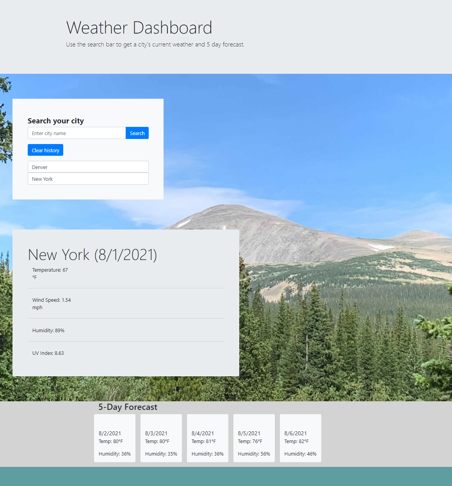

# Devin's Weather Dashboard

## Description

The goal of this homework assignment was to showcase my knowledge of server side API's. I was able to fetch data from Open Weathers API and use that to display current weather conditions for a searched city. These skills will provide useful when making dynamic web applications. 

## User Story
```md
AS A traveler
I WANT to see the weather outlook for multiple cities
SO THAT I can plan a trip accordingly
```

## Tasks Completed

- WHEN I search for a city
- THEN I am presented with current and future conditions for that city and that city is added to the search history
- WHEN I view current weather conditions for that city
- THEN I am presented with the city name, the date, an icon representation of weather conditions, the temperature, the humidity, the wind speed, and the UV index
- WHEN I view the UV index
- THEN I am presented with a color that indicates whether the conditions are favorable, moderate, or severe
- WHEN I view future weather conditions for that city
- THEN I am presented with a 5-day forecast that displays the date, an icon representation of weather conditions, the temperature, the wind speed, and the humidity
- WHEN I click on a city in the search history
- THEN I am again presented with current and future conditions for that city

## How to use the dashboard.

Links to access the weather dashboard:

- [Repo Link](https://github.com/DMosca2021/dm_hmwk_wk6_weatherApp)
- [Deployed Link](https://dmosca2021.github.io/dm_hmwk_wk6_weatherApp/)

Click on deployed link. Once at the weather dashboard, input a city name into the search bar to recieve the current weather data and 5 day forecast. 



## Credits
Credit for this project goes to my instructor, teachers assistant, tutor, and fellow students in the DUbootcamp who provided the information and resources I needed to complete this task.

- [Open Weather API](https://openweathermap.org/)
- [MDN](https://developer.mozilla.org/en-US/docs/Web/JavaScript/Reference/Global_Objects/Date)
- [Google](https://www.google.com/)